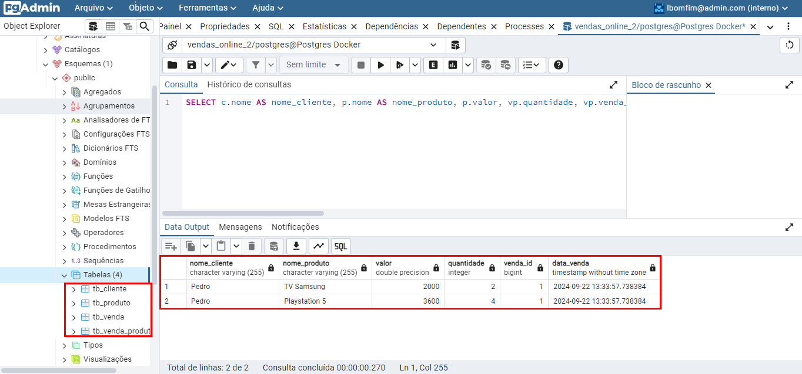
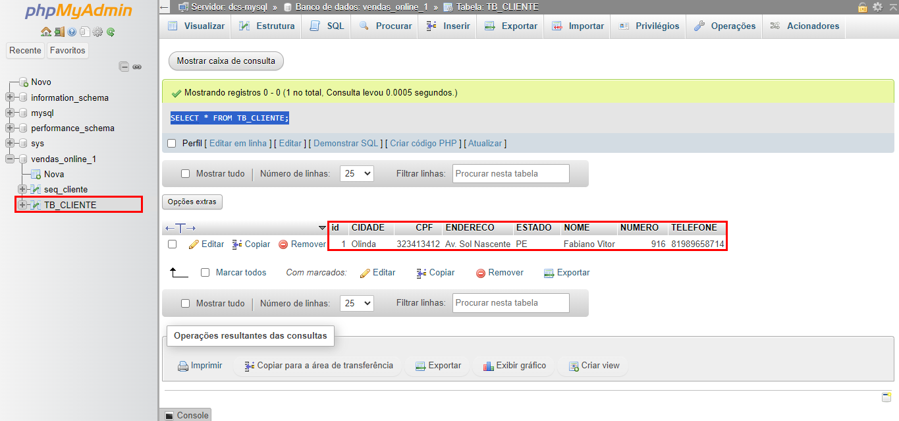

# Dual Database Connector (PostgreSQL and MySQL)

## Proposta

Este programa é uma aplicação de gerenciamento de vendas que permite a conexão e interação com dois bancos de dados diferentes: MySQL e PostgreSQL. O sistema é projetado para facilitar operações de CRUD (Create, Read, Update, Delete) em entidades relacionadas a vendas, como `Cliente`, `Cliente2`,`Produto`, `Venda` e `VendaProduto`.

A principal finalidade é demonstrar como utilizar JPA (Java Persistence API) para gerenciar a persistência de dados em **múltiplos bancos de dados**, possibilitando a flexibilidade de escolher entre eles conforme necessário. O programa é dividido em várias classes DAO (Data Access Object) que implementam uma interface genérica, permitindo uma abordagem modular e reutilizável para operações de banco de dados.

## Funcionalidades

- **Gerenciamento de Clientes:** Cadastro, atualização e consulta de informações de clientes.

- **Gerenciamento de Produtos:** Cadastro e gerenciamento de produtos disponíveis para venda.

- **Registro de Vendas:** Criação de registros de vendas, incluindo a associação de produtos e clientes.

- **Suporte a Múltiplos Bancos de Dados:** Conexão simultânea a bancos de dados MySQL e PostgreSQL, permitindo operações flexíveis de acordo com a necessidade do usuário.

## Tecnologias Utilizadas

- Java.
- JPA.
- MySQL.
- PostgreSQL.
- Docker.

## Utilização na prática

- O programa possui uma classe de teste que realiza operações CRUD no banco de dados PostgreSQL, simulando o processo de venda, onde é possível observar a relação entre as entidades **Cliente**, **Produto**, **Venda** e **VendaProduto**.

- Paralelamente, há outra classe de teste que executa o CRUD apenas para a entidade **Cliente2** no banco de dados MySQL, demonstrando a utilização de um ambiente com múltiplos bancos de dados para armazenamento.

- Neste exemplo, foram inseridos dois clientes distintos, mas seria viável cadastrar o mesmo cliente em ambos os bancos de dados, dependendo da necessidade.

## Observações 

- Certifique-se de que o banco de dados esteja configurado corretamente.
- As exclusões na tabela `tb_venda_produto` não são feitas automaticamente quando uma venda é excluída.

## Autor

**Lucas Bomfim** - Desenvolvedor do projeto.

## Contribuição

Sinta-se à vontade para contribuir com melhorias ou correções!

## Licença

Este projeto é licenciado sob a MIT License - veja o arquivo [LICENSE](LICENSE) para mais detalhes.